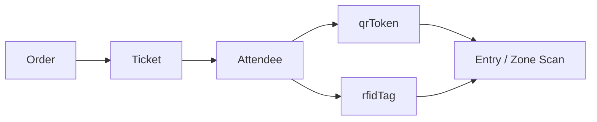

# ENTRYNEX / EAMS

**Event Access Management System**

## Overview
The ENTRYNEX/EAMS project is a full‑stack application for managing events, ticketing, access control, payments, and staff operations. It includes a React frontend, an Express/Mongoose backend, a MongoDB data layer, and real-time access logging for QR and RFID event scanning.

## Core Identity & Access Model
The system supports both QR and RFID access as interchangeable check-in methods.

- Each attendee record can hold both a `qrToken` and an `rfidTag`.
- The same attendee can be validated by either the QR code or a 10-digit RFID value emitted by a USB keyboard-wedge reader.
- The scan result is logged with a `method` field as either `qr` or `rfid`.
- Ticket purchase flow creates or links an attendee to the purchased ticket, generates a QR code, and optionally allocates an RFID from the event/category inventory.

### Ticket to attendee relationship


For event access, the system does not treat QR and RFID as separate user identities. They are two ways to resolve the same attendee record.

## Features
- Event creation & management with support for multiple event types
- Ticket ordering, assignment, and QR code generation
- RFID inventory management per event and category
- Event category-based RFID allocation from admin inventory
- Entry and zone scanning by QR code or RFID reader
- Multiple payment methods, including cash-at-entry and online gateways
- Role-based access control (admin, organiser, staff, auditor, attendee, sponsor, etc.)
- Real-time updates via Socket.io
- Notifications through email, SMS, and WhatsApp
- Zone-based access control and logging
- Sponsor package management
- Photo verification for attendees
- Short-link and event-page generation

## RFID Reader Support
The system supports a USB EM4100/TK4100 keyboard-wedge reader. It emits a 10-digit RFID value followed by Enter, so no external RFID SDK is required.

### Reader behavior
- Reader mode is available in entry and zone scanner flows.
- The value is normalized to a 10-digit string and matched against the attendee `rfidTag` field.
- A scan can resolve the same attendee as a QR scan, preserving the same access logic and audit trail.
- The backend logs scans as `method: "rfid"` so staff and admins can distinguish the source without changing the validation rules.

### Admin RFID inventory workflow
Admins can now add RFID codes to the system in two ways:
1. One-by-one via the RFID inventory screen.
2. Bulk import through Excel upload containing RFID codes for a selected event and category.

The inventory is stored as event-scoped tags with category association, and the next available tag is assigned when a ticket is linked to an attendee.

### API support
- `POST /api/attendees/:id/rfid` – assign a specific RFID tag to an attendee
- `DELETE /api/attendees/:id/rfid` – clear an attendee RFID tag
- `GET /api/rfid/events/:eventId` – list RFID inventory for an event
- `POST /api/rfid/events/:eventId/tags` – add one or many tags to the inventory
- `POST /api/rfid/events/:eventId/upload` – import RFID codes from Excel

## Technology Stack
- **Frontend:** React, Tailwind CSS, Heroicons
- **Backend:** Node.js, Express, Mongoose, Socket.io
- **Database:** MongoDB
- **Auth:** JWT with MFA support
- **Payments:** Stripe / PayHere (webhooks)
- **Messaging:** SendGrid, Twilio, Azure Blob Storage
- **QR Codes:** qrcode library for ticket generation

## Prerequisites
- Node.js 18+
- npm
- MongoDB instance (local or remote)
- Environment variables (see [docs/15_ENVIRONMENT_CONFIGURATION.md](docs/15_ENVIRONMENT_CONFIGURATION.md))

## Installation
```bash
# Clone repo
git clone <repo-url>
cd eams

# Backend
cd backend
cp .env.example .env   # set variables
npm install
npm run dev   # starts server on port 5000

# Frontend
cd ../frontend
cp .env.example .env   # set REACT_APP_API_URL, etc.
npm install
npm start   # runs on http://localhost:3000
```

## Documentation Index
- [01_PROJECT_OVERVIEW.md](docs/01_PROJECT_OVERVIEW.md) - High-level project overview and core modules
- [02_SYSTEM_ARCHITECTURE.md](docs/02_SYSTEM_ARCHITECTURE.md) - System architecture and component interactions
- [03_PROJECT_STRUCTURE.md](docs/03_PROJECT_STRUCTURE.md) - Repository structure and key directories
- [04_DATABASE_DOCUMENTATION.md](docs/04_DATABASE_DOCUMENTATION.md) - MongoDB collections and model definitions
- [05_DATABASE_RELATIONSHIPS.md](docs/05_DATABASE_RELATIONSHIPS.md) - Database relationships and references
- [06_API_DOCUMENTATION.md](docs/06_API_DOCUMENTATION.md) - Complete API endpoint reference
- [07_AUTHENTICATION_AUTHORIZATION.md](docs/07_AUTHENTICATION_AUTHORIZATION.md) - Auth mechanisms and JWT implementation
- [08_ROLES_PERMISSIONS.md](docs/08_ROLES_PERMISSIONS.md) - User roles and permission system
- [09_BUSINESS_LOGIC.md](docs/09_BUSINESS_LOGIC.md) - Core business logic flows
- [10_PAYMENT_TICKETING_FLOWS.md](docs/10_PAYMENT_TICKETING_FLOWS.md) - Payment processing and ticketing workflows
- [11_ZONE_ACCESS_CONTROL.md](docs/11_ZONE_ACCESS_CONTROL.md) - Zone-based access control system
- [12_NOTIFICATION_SYSTEM.md](docs/12_NOTIFICATION_SYSTEM.md) - Email, SMS, and WhatsApp notifications
- [13_SECURITY_DOCUMENTATION.md](docs/13_SECURITY_DOCUMENTATION.md) - Security best practices and implementation
- [14_ERROR_HANDLING_LOGGING.md](docs/14_ERROR_HANDLING_LOGGING.md) - Error handling and logging strategies
- [15_ENVIRONMENT_CONFIGURATION.md](docs/15_ENVIRONMENT_CONFIGURATION.md) - Environment variables and configuration
- [16_DEPLOYMENT_GUIDE.md](docs/16_DEPLOYMENT_GUIDE.md) - Deployment instructions
- [17_OPERATIONS_GUIDE.md](docs/17_OPERATIONS_GUIDE.md) - Operational procedures
- [18_TROUBLESHOOTING.md](docs/18_TROUBLESHOOTING.md) - Common issues and solutions
- [19_CHANGELOG.md](docs/19_CHANGELOG.md) - Project changelog
- [20_SECRET_ROTATION_AND_REMOVAL.md](docs/20_SECRET_ROTATION_AND_REMOVAL.md) - Secret management

## Running Tests
No automated test suites are included in this repository. The previous testing guide has been archived in [docs/17_TESTING_GUIDE.md](docs/17_TESTING_GUIDE.md).

## Deploying
See [docs/16_DEPLOYMENT_GUIDE.md](docs/16_DEPLOYMENT_GUIDE.md).

## Recent Updates
- **2026-09-10**: Added event/category RFID inventory, automatic RFID allocation, and QR + RFID attendee linkage for purchased tickets.
- **2026-08-31**: Fixed undefined `conference` error in EventDetailPage by adding proper variable extraction from event object
- **2026-08-05**: Updated error handling and logging documentation
- **2026-07-30**: Added comprehensive documentation files covering security, deployment, operations, and troubleshooting