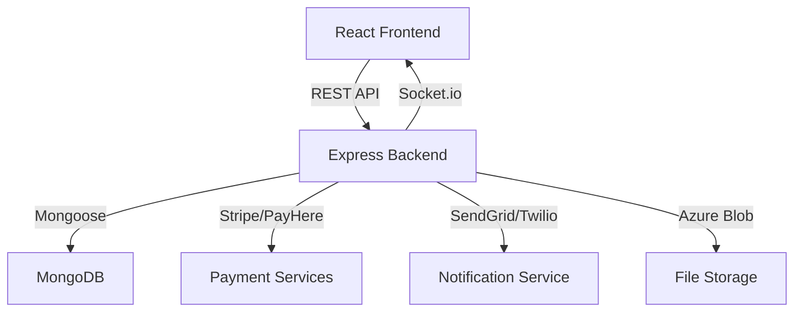

# 01_PROJECT_OVERVIEW

**ENTRYNEX / EAMS** – Event Access Management System.

### Purpose
Manage end‑to‑end event lifecycles:
- Event creation and configuration
- Ticket ordering, assignment and QR‑code generation
- Multiple payment methods (card, bank transfer, cash at entrance)
- Role‑based access control (Admin, Organiser, Sub‑Organiser, Staff, Auditor, Attendee, Sponsor)
- Real‑time updates via Socket.io
- Notification system (email, SMS, WhatsApp)
- Zone based access control and logging

### Core Modules
| Module | Description |
|--------|-------------|
| **Frontend** | React SPA (`frontend/src`) – pages for buyers, organisers, auditors, staff, etc. Uses Tailwind CSS and Heroicons for UI.
| **Backend** | Node.js/Express API (`backend/src`) – authentication, payments, ticketing, event management, logging, notifications.
| **Database** | MongoDB with Mongoose models for Users, Companies, Events, Orders, Tickets, Attendees, Payments, Zones, Logs, etc.
| **Realtime** | Socket.io server (`src/utils/socket.js`) pushes events like `order_status_changed` to buyers.
| **Integrations** | Stripe/PayHere webhooks, SendGrid email, Twilio SMS/WhatsApp, Azure Blob Storage for uploads, QRcode generation.

### High‑Level Architecture (Mermaid)

### Current Implementation Status
- All core features **Implemented** (event CRUD, ticket ordering, assignment, QR generation, payments, notifications).
- Zone management **Implemented** but advanced UI for zone assignment is partial.
- Docker/CI‑CD **Not Implemented** – deployment guides are manual.
- Comprehensive automated tests **Not Implemented** – repository contains only a few test scripts.

---
*Generated from actual source code (models, controllers, routes, services).*
