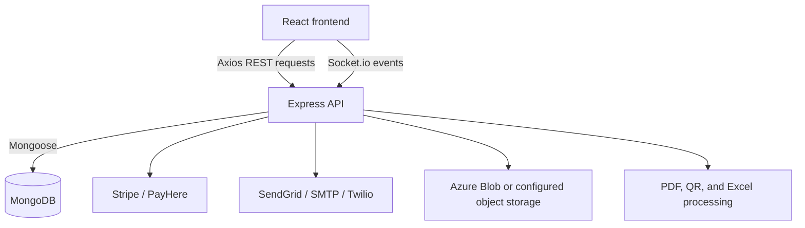
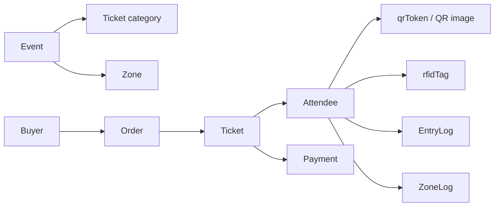
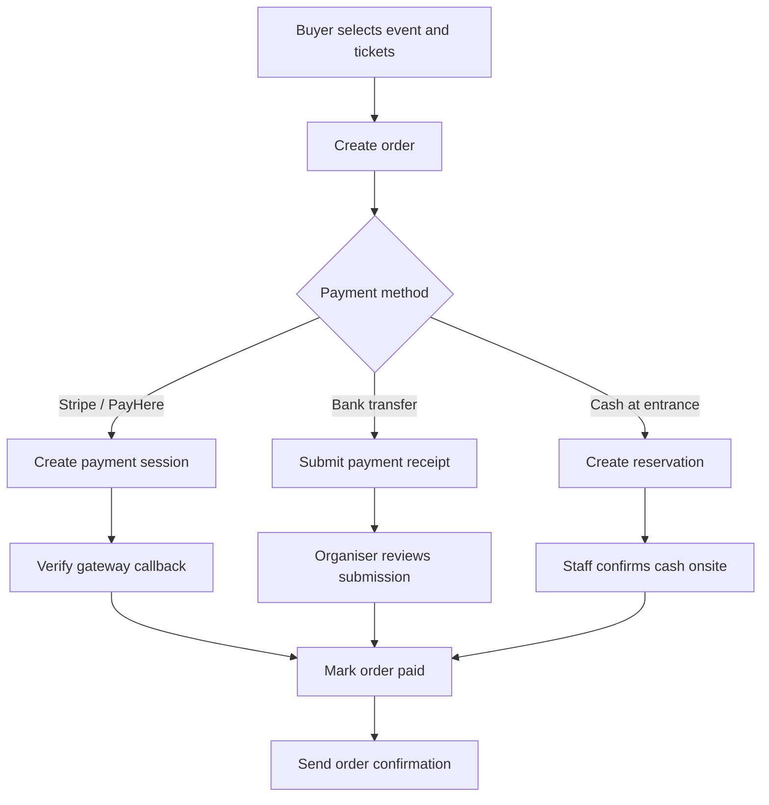
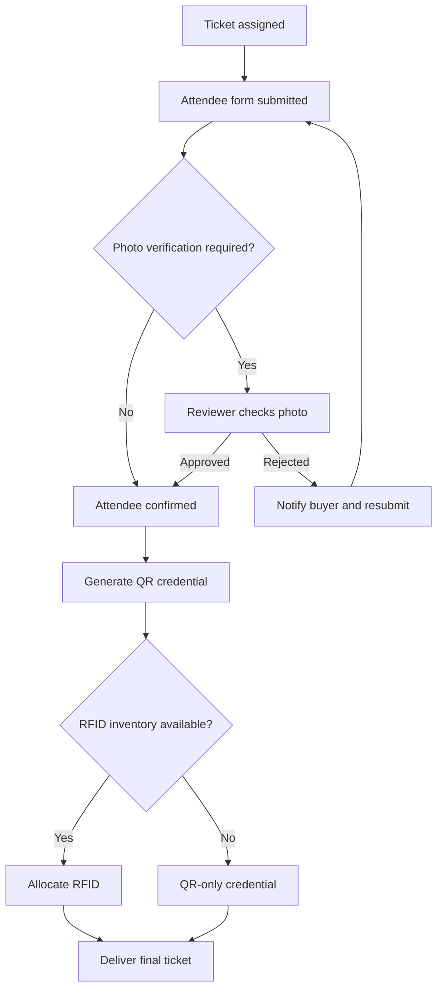
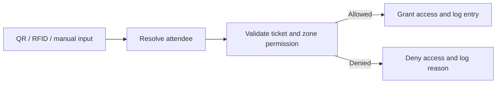

# 01_PROJECT_OVERVIEW

## EAMS / ENTRYNEX

EAMS (Event Access Management System) is a full-stack event operations platform. It connects event setup, ticket sales, attendee identity collection, payment confirmation, ticket delivery, and controlled event access in one workflow.

## Product Goals

- Let administrators and organisers configure and publish events.
- Let buyers reserve and purchase tickets using supported payment methods.
- Collect and verify attendee identity details and photos.
- Deliver a confirmed ticket with a QR code and, when configured, an RFID tag.
- Validate entry and zone access using QR, RFID, or manual lookup.
- Give staff and organisers live operational dashboards, logs, reports, and notifications.

## Main Features

### Event management

- Create, edit, publish, and remove events.
- Configure event dates, descriptions, ticket categories, prices, capacity, zones, custom fields, and communication channels.
- Assign organisers and scoped team members to events.
- Create short links for public event pages and notifications.

### Ticketing and buyers

- List public events and view event details.
- Create ticket orders and assign tickets to attendees.
- Support online payment, bank transfer, and cash at entrance/reservation flows.
- View order history, payment history, tickets, invites, and order status.
- Cancel orders or request refunds where the configured workflow permits.

### Attendee identity and verification

- Capture name, contact details, identity/passport data, custom event fields, and a photo.
- Send attendee invitations using a secure token with an expiry time.
- Approve or reject photos and allow rejected photos to be resubmitted.
- Detect duplicate photos and validate uploaded image type, size, and dimensions.
- Generate a QR token and QR image for confirmed attendees.

### QR and RFID access

- Scan QR codes at the main entrance and at zones.
- Accept a 10-digit RFID value from a USB keyboard-wedge reader.
- Treat QR and RFID as two credentials for the same attendee record.
- Import RFID tags from Excel or add them individually to event/category inventory.
- Allocate the next available event/category RFID tag during ticket assignment.
- Record the scan method, result, operator, event, zone, and timestamp in access logs.

### Payments and ticket delivery

- Use PayHere or Stripe when enabled by system configuration.
- Verify gateway callbacks and webhooks before changing payment status.
- Reserve orders for cash-at-entrance and confirm them after onsite collection.
- Generate PDF tickets and order summaries.
- Send final tickets to attendees and a consolidated summary to the buyer.

### Roles and operations

- Support main admin, super admin, main organiser, sub-organiser, staff, volunteer, auditor, buyer, attendee, and sponsor roles.
- Enforce permissions and event scope through JWT authentication and RBAC middleware.
- Provide dashboards for sales, attendees, payments, entry activity, denied scans, and reports.
- Persist notifications and deliver them through email, SMS, and WhatsApp when enabled.
- Allow administrators and operational roles to continue working during maintenance mode.

## System Architecture

### Application layers

| Layer | Location | Responsibility |
|---|---|---|
| Frontend | `frontend/src` | React pages, forms, dashboards, scanners, route protection, and user feedback. |
| Routes | `backend/src/routes` | HTTP endpoints, validation, authentication, permissions, and event scoping. |
| Controllers | `backend/src/controllers` | Request-level orchestration for buyers, organisers, admins, payments, dashboards, and verification. |
| Services | `backend/src/services` | Payment, notification, ticket delivery, PDF, photo, RFID, storage, and short-link business logic. |
| Models | `backend/src/models` | Mongoose schemas for users, events, orders, tickets, attendees, zones, logs, notifications, and configuration. |
| Realtime | `backend/src/utils/socket.js` | Socket.io events for status changes, maintenance changes, and live operational updates. |

## Important Backend Functions

| Function or service | Purpose |
|---|---|
| `paymentService.createPaymentSession()` | Creates a Stripe Checkout session or PayHere payment payload. |
| `paymentService.getPayHereHash()` | Creates the PayHere security hash for a payment request. |
| `finalConfirmationService.processOrderFinalConfirmation()` | Finalises an eligible order, delivers tickets, and sends the buyer summary. |
| `ticketDeliveryService` | Builds and sends ticket PDFs and updates delivery status. |
| `notificationService.notifyOrderConfirmation()` | Sends order confirmation through configured notification channels. |
| `notificationService.notifyAttendeeInvite()` | Sends an attendee invitation link. |
| `photoValidationService` | Validates and checks uploaded attendee photos. |
| `rfidService.allocateRfid()` | Assigns the next available RFID tag for an event and ticket category. |
| `rfidService.normalizeRfidTag()` | Normalizes reader input before matching. |
| `shortLinkService.createShortLink()` | Creates a short URL for a supported application route. |
| Entry and zone scan handlers | Resolve QR/RFID credentials, check permissions, and create entry or zone logs. |

## Core Data Relationships

- An `Order` belongs to a buyer and contains ticket items.
- A `Ticket` belongs to an event/order and can be linked to one attendee.
- An `Attendee` is the identity used by both QR and RFID validation.
- An attendee can have allowed zones and a ticket category that controls access.
- `EntryLog` and `ZoneLog` preserve the access audit trail.

## End-to-End Flows

### 1. Event setup

1. An admin or organiser creates an event.
2. Ticket categories, prices, capacity, custom fields, zones, and access rules are configured.
3. Optional RFID inventory is added for each event/category, individually or through Excel upload.
4. The event is assigned to the responsible organiser/team and published.
5. Buyers can view the public event page and begin checkout.

### 2. Purchase and payment

Payment status is changed only after the relevant gateway, organiser, or staff confirmation. Cash reservations remain pending until the onsite payment is confirmed.

### 3. Attendee assignment and confirmation

1. The buyer assigns an attendee to each purchased ticket.
2. The platform creates or updates the attendee record.
3. The attendee receives an invitation link, unless the buyer completes the form directly.
4. The attendee submits identity details, custom fields, and a photo.
5. If photo verification is enabled, an authorised reviewer approves or rejects the photo.
6. A rejected photo can be resubmitted with the rejection reason preserved.
7. On confirmation, the system generates the attendee QR token and image.
8. If inventory exists for the ticket category, `rfidService.allocateRfid()` assigns an RFID tag.

### 4. Entry and zone access

1. Staff opens an entry or zone scanner.
2. The scanner receives a QR value, RFID value, or manual search input.
3. The backend normalizes the value and resolves the attendee.
4. The system checks ticket validity, event scope, attendee confirmation, duplicate entry rules, and zone permissions.
5. The scan is accepted or denied.
6. An entry or zone log is stored with the credential type (`qr` or `rfid`) and operator details.
7. Socket.io and dashboard views can update operational activity in real time.

### 5. Notifications and delivery

- Order confirmations are sent after payment confirmation.
- Invitations include a secure attendee confirmation link.
- Photo rejection messages include the reviewer reason and resubmission path.
- Final attendee tickets include QR details and a generated PDF.
- Buyers receive a final summary after all tickets are processed.
- Channel selection is controlled by system and event settings; email, SMS, and WhatsApp are supported where configured.
- Notifications are also persisted for display in the relevant dashboard.

### 6. Maintenance mode

1. An authorised admin changes `general.systemStatus` to `Maintenance`.
2. The backend middleware returns `503` for normal non-bypass requests.
3. The public configuration endpoint exposes `maintenanceMode` and `systemStatus`.
4. The frontend shows the maintenance page and keeps login available.
5. Socket.io broadcasts `system:maintenance-mode-changed`, allowing open clients to update without refresh.
6. Authorised operational roles can continue using their dashboards.

## Key API Areas

| API area | Main responsibilities |
|---|---|
| `/api/auth/*` | Registration, login, email verification, password reset, MFA, refresh, and logout. |
| `/api/events/*` | Public event data, event management, publishing, dashboards, and public configuration. |
| `/api/orders/*` and `/api/buyer/*` | Order creation, buyer history, cancellation, refunds, assignments, and invites. |
| `/api/payment/*` and `/api/bank-transfer/*` | Payment sessions, callbacks, reservations, receipts, and approval workflows. |
| `/api/attendees/*` and `/api/verification/*` | Attendee forms, bulk upload, invitations, photo review, and resubmission. |
| `/api/rfid/*` | Event/category RFID inventory, individual additions, and Excel imports. |
| `/api/entry/*` and `/api/zone/*` | QR/RFID scanning, access validation, logs, statistics, and zone reports. |
| `/api/notifications/*` | Retrieve notifications and mark them read. |
| `/api/admin/*`, `/api/organiser/*`, and `/api/super-admin/*` | Administration, team management, reports, configuration, and system operations. |

## Technology Stack

- Frontend: React 18, React Router, Tailwind CSS, Axios, Recharts, Heroicons, and Socket.io client.
- Backend: Node.js, Express, Mongoose, JWT, bcrypt, Socket.io, and express-validator.
- Database: MongoDB.
- Payments: Stripe and PayHere adapters, plus bank transfer and cash-at-entrance workflows.
- Messaging: SendGrid, SMTP/Nodemailer, Twilio SMS, and Twilio WhatsApp.
- Files and media: Azure Blob or configured object storage, Multer, Sharp, ExcelJS/XLSX, PDFKit, and QRCode.

## Current Boundaries

- Core event, ticket, payment, attendee, notification, QR, RFID, entry, and zone workflows are implemented in the repository.
- Advanced automated test coverage is limited; operational verification should follow `docs/17_TESTING_GUIDE.md`.
- Deployment is documented as a manual process in `docs/16_DEPLOYMENT_GUIDE.md`; Docker and CI/CD are not the primary project workflow.

See the rest of the `docs/` directory for detailed architecture, data models, security, configuration, deployment, operations, and troubleshooting information.
