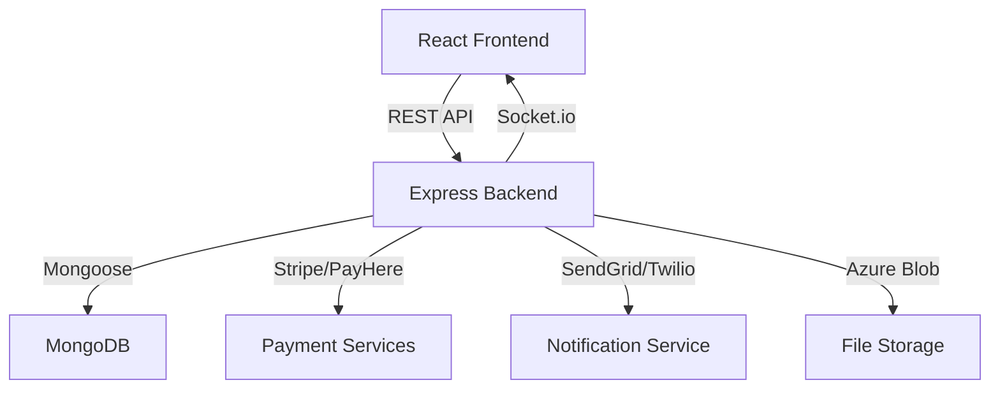

# 02_SYSTEM_ARCHITECTURE

## High‑Level Architecture

## Components
- **Frontend** (`frontend/src`)
  - React SPA with pages for buyers, organisers, staff, auditors, etc.
  - Tailwind CSS for styling and Heroicons for icons.
  - Communicates with backend via the `api` module (`src/api/*.js`).
- **Backend** (`backend/src`)
  - Express server (`src/server.js`) exposing REST endpoints.
  - Authentication via JWT (`src/middleware/auth.js`).
  - Real‑time updates with Socket.io (`src/utils/socket.js`).
  - Business logic in services (`src/services/*`).
- **Database** (`MongoDB`)
  - Mongoose models define collections (see **04_DATABASE_DOCUMENTATION.md**).
- **Integrations**
  - **Payments** – Stripe and PayHere webhooks handled in `src/routes/payment.js`.
  - **Email** – SendGrid (`src/services/email.js`).
  - **SMS/WhatsApp** – Twilio (`src/services/sms.js`).
  - **File Storage** – Azure Blob Storage for uploads (`src/services/upload.js`).
- **Logging & Auditing**
  - Request logs, entry logs, zone logs, audit logs via Mongoose models and middleware.

## Data Flow (Typical Order)
1. User authenticates (login → JWT).
2. Frontend calls `/buyer/orders/:id` → backend returns order & tickets.
3. Buyer assigns attendee → `POST /buyer/assign` → backend updates ticket, sends email, emits Socket.io event.
4. Payment webhook updates order status → backend emits `order_status_changed`.
5. UI receives socket event, updates UI in real time.

---
*All diagrams and descriptions are based on the actual source code.*
