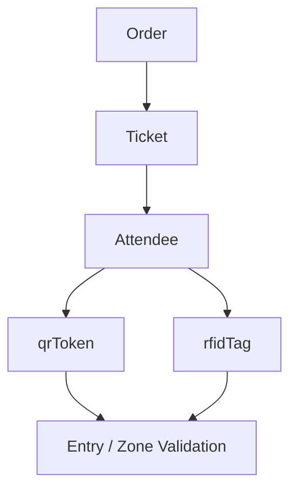

# 10_PAYMENT_TICKETING_FLOWS

## Overview
The EAMS platform supports multiple payment gateways and defines a clear ticket lifecycle that maps payment status to ticket status.

### Payment Gateways
| Gateway | Configuration Source | Enabled by Default |
|---------|----------------------|-------------------|
| **PayHere** (Sri Lanka) | `SystemConfig.payment` or env vars `PAYHERE_MERCHANT_ID` / `PAYHERE_SECRET` | Yes |
| **Stripe** | `SystemConfig.payment.gateways.stripe.secretKey` or env `STRIPE_SECRET_KEY` | No (must be enabled) |

Gateway information is retrieved via `paymentService.getActiveGateways()` which returns:
- `activeGateways` – list of enabled providers.
- `defaultGateway` – the gateway used when none is specified.
- `currency` – default currency (e.g., `LKR`).

### Payment Flow
1. **Order Creation** – Buyer creates an order (`POST /buyer/orders`). The order is stored with status `PENDING` and a unique `orderNumber`.
2. **Select Gateway** – Front‑end calls `/api/payment/gateways` to fetch enabled gateways, then requests a payment session via `/api/payment/create-session` providing the chosen gateway.
3. **Session Generation** – `paymentService.createPaymentSession(order, event, gateway)` returns:
   - For **Stripe** – a Checkout Session URL (`session.url`).
   - For **PayHere** – a data object containing merchant details and a security **hash** generated by `paymentService.getPayHereHash`.
4. **User Pays** – User is redirected to the gateway. On success/failure the gateway calls back to `/api/payment/notify` (PayHere) or Stripe webhook endpoint.
5. **Webhook Handling** – Backend verifies the notification, updates `Order.paymentStatus` (e.g., `paid`, `failed`) and `Order.status` (e.g., `CONFIRMED`). It also records `paidAt` and `gatewayUsed`.
6. **Post‑Payment Actions** – After successful payment, `notificationService.notifyOrderConfirmation` sends email/SMS confirmations and creates a persistent `Notification` entry.
   - For *Cash at Entrance* payments the flow differs: the order is **reserved** (`status: RESERVED`) and a cash‑reservation email/SMS is sent (`sendCashReservationEmail`, `sendCashReservationSMS`). Once cash is collected onsite, `sendCashPaymentConfirmedEmail` finalises the order and marks tickets `SOLD`.

### Ticket Lifecycle & Payment Mapping
| Ticket Status | Description | Triggered By |
|---------------|-------------|--------------|
| `PENDING` | Order created, tickets not yet assigned. | Order creation |
| `ASSIGNED` | Buyer assigned an attendee to a ticket slot. | `/buyer/assign` |
| `INVITED` | Invitation email/SMS sent to attendee. | `notificationService.notifyInvite` |
| `CONFIRMED` | Attendee accepted invitation or admin confirms. | Invite acceptance flow |
| `SOLD` | Payment confirmed and all tickets finalized. | `finalConfirmationService` after successful payment or cash‑at‑entrance verification |
| `CANCELLED` | Order or ticket cancelled by user or admin. | `/buyer/cancel` or admin endpoint |

### QR + RFID Linkage in the Ticket Lifecycle
The system explicitly connects the purchased ticket and the attendee identity to both access tokens:

1. Buyer creates or finalises the order for a sold ticket.
2. When the ticket is assigned to an attendee, the backend creates or updates an `Attendee` record.
3. The attendee receives a `qrToken` and a generated QR image.
4. If the event category has RFID inventory configured, the backend allocates the next available tag from `RfidTag` collection and stores it on the attendee as `rfidTag`.
5. Later, the same attendee can be validated by either QR token or RFID tag during entry or zone access.

### Event Category RFID Allocation
RFID inventory is not random or global. It is event-scoped and category-scoped:

- `RfidTag` records hold: `event`, `categoryId`, `rfidTag`, `status`, `attendee`, `ticket`, `sequence`.
- Each tag is unique within an event.
- When a new attendee is assigned to a category ticket, the system picks the next available tag in sequence for that event/category.
- The assigned RFID is persisted on the attendee and remains tied to that attendee until cleared manually or re-imported.

### Key Service Functions
- `paymentService.createPaymentSession(order, event, gateway)` – Dispatcher for Stripe/PayHere.
- `paymentService.getPayHereHash(orderId, amount, currency)` – Generates MD5 hash required by PayHere.
- `paymentService.createStripeSession(order, event)` – Builds Stripe Checkout session.
- `rfidService.allocateRfid({ eventId, categoryId, attendeeId, ticketId })` – Allocates the next available RFID tag for the ticket category.
- `notificationService.notifyOrderConfirmation` – Sends order confirmation via configured channels.
- `notificationService.sendCashReservationEmail/SMS` – Handles *Cash at Entrance* pending state.
- `notificationService.sendCashPaymentConfirmedEmail` – Finalises cash payment flow.

---
*All information extracted from `backend/src/services/paymentService.js`, `backend/src/services/rfidService.js`, `backend/src/models/Order.js`, `backend/src/models/Attendee.js`, and related notification service functions.*
