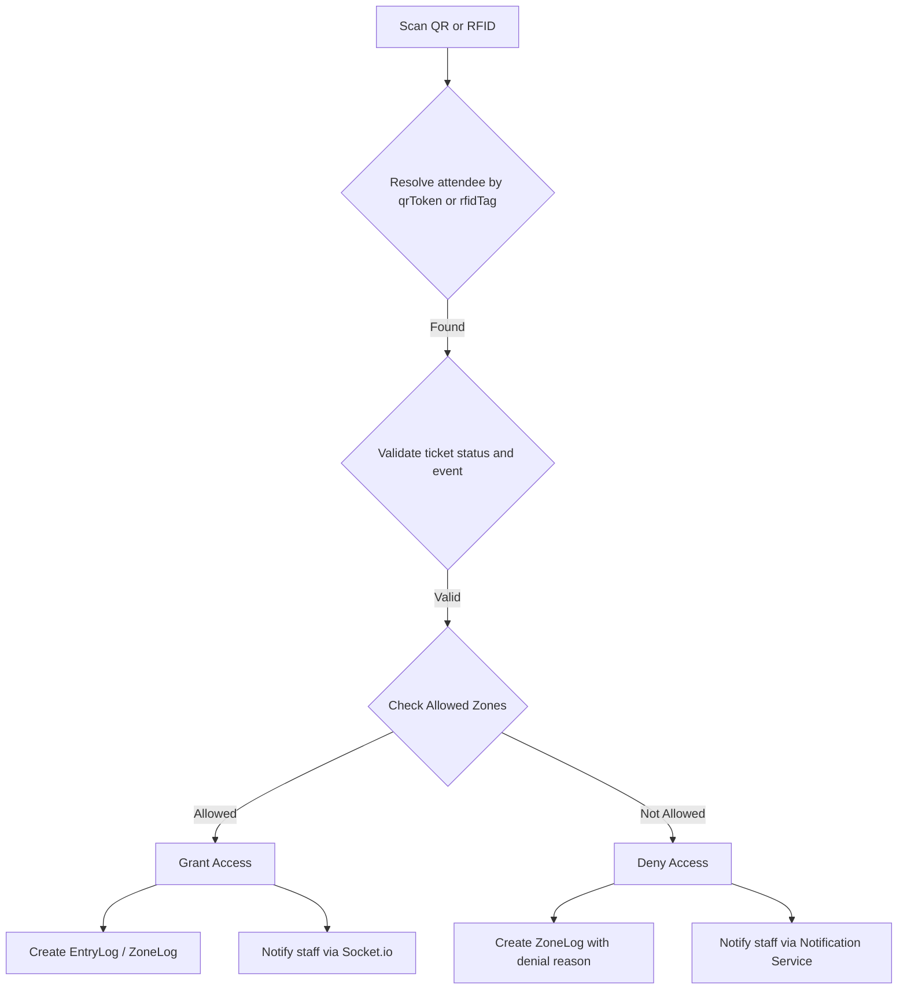

# 11_ZONE_ACCESS_CONTROL

## Overview
Zone access control determines whether an attendee may **enter** or **exit** a physical area (zone) within an event venue. The logic lives primarily in the **backend**:
- `backend/src/models/ZoneLog.js` records each scan attempt.
- `backend/src/models/EntryLog.js` records successful entry/exit events.
- `backend/src/services/notificationService.js` sends real‑time alerts when access is denied.
- Socket.io events (`zone:${zoneId}`) push live updates to staff dashboards.

## Data Model
| Model | Key Fields | Purpose |
|-------|------------|---------|
| **ZoneLog** | `attendeeId`, `eventId`, `zoneName`, `action` (ENTRY/EXIT), `accessGranted`, `denialReason`, `scanMethod` | Immutable audit of every scan attempt, successful or not. |
| **EntryLog** | `attendeeId`, `eventId`, `zoneId`, `zoneName`, `action` (check_in/check_out/zone_entry/zone_exit), `timestamp` | Stores successful entry/exit events for reporting. |
| **Ticket** (referenced) | `allowedZones` (array of zone IDs) | Declares which zones a ticket holder may access. |
| **Attendee** | `ticket` (ref), `zoneIds` (optional) | Represents the person assigned to a ticket; may carry zone restrictions. |

## Access Evaluation Flow

1. **Resolve attendee** – The backend checks `qrToken` first or, if the input is a 10-digit RFID, matches `rfidTag` within the selected event.
2. **Validate ticket** – `Ticket` is fetched and must be in a status that permits entry (`CONFIRMED`, `SOLD`, or equivalent allowed states).
3. **Check allowed zones** – The ticket’s `allowedZones` array is compared with the scanned `zoneName`.
4. **Grant/Deny** – If allowed, an `EntryLog` or zone event is created and the gate opens; otherwise a `ZoneLog` with `accessGranted: false` and a `denialReason` (`NOT_ALLOWED`, `INVALID_TICKET`, `DUPLICATE_SCAN`, etc.) is stored.
5. **Notification** – Staff receive real-time updates via the `notifyStatusChange` function and Socket.IO events.

## RFID as a first-class access method
RFID is intentionally treated the same as QR for event access. The difference is only in the input channel:

- QR flow: scan generated QR code, resolve attendee via `qrToken`.
- RFID flow: present card to reader, normalize the 10-digit value, resolve attendee via `rfidTag`.
- The same response path is used in entry scanning and zone access, with `method` stored as `rfid` for auditing.

This means staff can operate either scanner mode without changing the actual event rules or denial logic.

## Configuration
- Global toggles for **SMS** and **WhatsApp** alerts are stored in `SystemConfig` under `communicationChannels.zoneAccess`.
- Per-event overrides can be set in `Event.settings.communicationChannels.zoneAccess`.
- RFID inventory and event/category assignment are controlled through the admin RFID inventory module and the category ticket assignment flow.

---
*All details derived from `ZoneLog.js`, `EntryLog.js`, `backend/src/routes/entry.js`, `backend/src/routes/zone.js`, `backend/src/services/rfidService.js`, and the staff scanner flows.*
