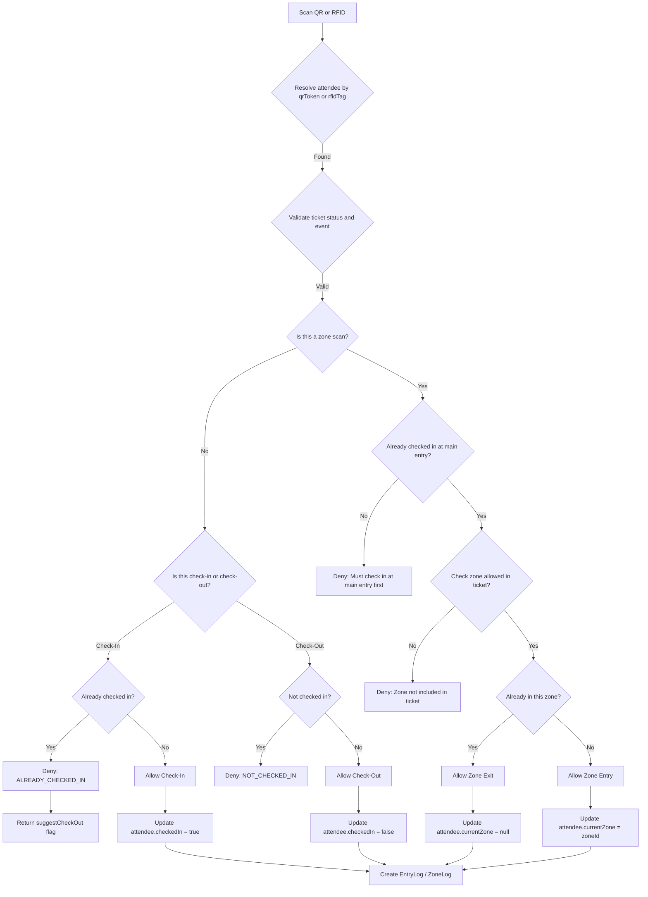

# 11_ZONE_ACCESS_CONTROL

## Overview
Zone access control determines whether an attendee may **enter** or **exit** a physical area (zone) within an event venue. The logic lives primarily in the **backend**:
- `backend/src/models/ZoneLog.js` records each zone scan attempt.
- `backend/src/models/EntryLog.js` records successful entry/exit events at main gates and zone transitions.
- `backend/src/services/notificationService.js` sends real‑time alerts when access is denied.
- Socket.io events (`zone:${zoneId}`, `entry_update`) push live updates to staff dashboards.

## Entry vs Zone Scanning
The system distinguishes between two scanning contexts:

### Entry Scanner (Main Entry/Gates)
- **Purpose**: Check attendees in/out at the main venue entrance
- **Actions**: `check_in` (Entry In), `check_out` (Entry Out)
- **Validations**:
  - Attendee must have valid, confirmed ticket
  - Attendee must not already be checked in (for check-in)
  - Attendee must be checked in (for check-out)
- **Zones**: Uses `gateId`/`gateName` rather than zone IDs
- **RFID Assignment**: After successful check-in, staff can assign RFID to non-RFID attendees

### Zone Scanner (Inner Zones)
- **Purpose**: Track attendee movement within the venue
- **Actions**: `ENTRY`, `EXIT` (auto-toggled based on current state)
- **Validations**:
  - Attendee must have checked in at main entry first
  - Attendee's ticket must allow access to the zone
  - Zone exit only allowed if attendee is currently in that zone
- **Tracking**: Uses `ZoneLog` for detailed zone movement records

## Data Model
| Model | Key Fields | Purpose |
|-------|------------|---------|
| **ZoneLog** | `attendeeId`, `eventId`, `zoneName`, `action` (ENTRY/EXIT), `accessGranted`, `denialReason`, `scanMethod` | Immutable audit of every zone scan attempt. |
| **EntryLog** | `attendeeId`, `eventId`, `zoneId`, `zoneName`, `action` (check_in/check_out/zone_entry/zone_exit), `timestamp` | Stores successful entry/exit events for reporting. |
| **Attendee** | `checkedIn` (boolean), `checkedInAt` (timestamp), `currentZone` (zone ID), `rfidTag` | Tracks current access state of attendee. |
| **Ticket** (referenced) | `allowedZones` (array of zone IDs) | Declares which zones a ticket holder may access. |

## Access Evaluation Flow

```mermaid
flowchart TD
    A[Scan QR or RFID] --> B{Resolve attendee by qrToken or rfidTag}
    B -->|Found| C{Validate ticket status and event}
    C -->|Valid| D{Is this a zone scan?}
    D -->|Yes| E{Already checked in at main entry?}
    D -->|No| F{Is this check-in or check-out?}
    F -->|Check-In| G{Already checked in?}
    F -->|Check-Out| H{Not checked in?}
    G -->|Yes| I[Deny: ALREADY_CHECKED_IN]
    G -->|No| J[Allow Check-In]
    H -->|Yes| K[Deny: NOT_CHECKED_IN]
    H -->|No| L[Allow Check-Out]
    E -->|No| M[Deny: Must check in at main entry first]
    E -->|Yes| N{Check zone allowed in ticket?}
    N -->|No| O[Deny: Zone not included in ticket]
    N -->|Yes| P{Already in this zone?}
    P -->|Yes| Q[Allow Zone Exit]
    P -->|No| R[Allow Zone Entry]
    I --> S[Return suggestCheckOut flag]
    J --> T[Update attendee.checkedIn = true]
    L --> U[Update attendee.checkedIn = false]
    Q --> V[Update attendee.currentZone = null]
    R --> W[Update attendee.currentZone = zoneId]
    T --> X[Create EntryLog / ZoneLog]
    U --> X
    V --> X
    W --> X
```

1. **Resolve attendee** – The backend checks `qrToken` first or, if the input is a 10-digit RFID, matches `rfidTag` within the selected event.
2. **Validate ticket** – `Ticket` is fetched and must be in a status that permits entry (`CONFIRMED`, `SOLD`, or equivalent allowed states).
3. **Check access based on context**:
   - **Entry scan**: Validate check-in/check-out state
   - **Zone scan**: Validate main entry check-in first, then zone access
4. **Grant/Deny** – Appropriate log entry is created with `accessGranted` flag and `denialReason`.
5. **Notification** – Staff receive real-time updates via Socket.IO events.

## Check-In/Check-Out State Management
The attendee state model includes:

| Field | Type | Description |
|-------|------|-------------|
| `checkedIn` | Boolean | True if attendee is currently inside the venue |
| `checkedInAt` | Date | Timestamp when check-in occurred |
| `currentZone` | String | ID of zone attendee is currently in (null if not in any zone) |
| `lastEntryMethod` | String | 'qr' or 'rfid' - credential used for last entry |
| `lastExitMethod` | String | 'qr' or 'rfid' - credential used for last exit |

### Valid State Transitions
| Current State | Action | Credential | New State | Allowed? |
|---------------|--------|------------|-----------|----------|
| Not checked in | Check-In | QR/RFID | Checked in | ✅ Yes |
| Checked in | Check-In | QR/RFID | Checked in | ❌ No (suggests switch to Exit) |
| Checked in | Check-Out | QR/RFID | Not checked in | ✅ Yes |
| Not checked in | Check-Out | QR/RFID | Not checked in | ❌ No (must check in first) |
| Checked in, not in zone | Zone Entry | QR/RFID | Checked in, in zone | ✅ Yes |
| In zone | Zone Entry | QR/RFID | In zone | ❌ No (already in zone - do Exit) |
| In zone | Zone Exit | QR/RFID | Checked in, not in zone | ✅ Yes |
| Not in zone | Zone Exit | QR/RFID | Not in zone | ❌ No (not in zone) |

## RFID as a First-Class Access Method
RFID is intentionally treated the same as QR for event access. The difference is only in the input channel:

- **QR flow**: scan generated QR code, resolve attendee via `qrToken`
- **RFID flow**: present card to reader, normalize the 10-digit value, resolve attendee via `rfidTag`
- **Credential Deduplication**: QR check-in → RFID check-out is allowed (and vice versa)

The same response path is used in entry scanning and zone access, with `method` stored as `rfid` or `qr` for auditing. Staff can operate either scanner mode without changing the actual event rules or denial logic.

## RFID Feature Toggle
RFID functionality is controlled by event settings:

```javascript
// Event.settings.rfidEnabled
event.settings = {
  rfidEnabled: true | false,  // Master toggle for RFID feature
  // ...
}
```

When disabled:
- RFID scanning mode is hidden from staff interfaces
- "RFID Not Assigned" prompts are hidden after successful scans
- Backend returns 403 `RFID_DISABLED` for any RFID operation
- RFID inventory is still visible but assignment is blocked

## Configuration
- Global toggles for **SMS** and **WhatsApp** alerts are stored in `SystemConfig` under `communicationChannels.zoneAccess`.
- Per-event overrides can be set in `Event.settings.communicationChannels.zoneAccess`.
- RFID feature toggle: `Event.settings.rfidEnabled`
- RFID inventory and event/category assignment are controlled through the admin RFID inventory module.

## API Endpoints
### Entry Scanning
- `POST /api/entry/scan` - Main entry check-in/check-out
- `POST /api/sub/scan-entry` - Sub-organizer entry scanning
- `POST /api/staff/scan-entry` - Staff entry scanning (delegates to entry routes)

### Zone Scanning
- `POST /api/zone/scan` - Zone entry/exit
- `POST /api/sub/scan-zone` - Sub-organizer zone scanning

### RFID Assignment
- `POST /api/entry/rfid-assign` - Assign RFID after QR scan
- `POST /api/sub/attendees/:id/rfid` - Sub-organizer RFID assignment

---
*All details derived from `ZoneLog.js`, `EntryLog.js`, `backend/src/routes/entry.js`, `backend/src/routes/sub.js`, `backend/src/routes/zone.js`, `backend/src/services/rfidService.js`, and the staff/suborganizer scanner flows.*