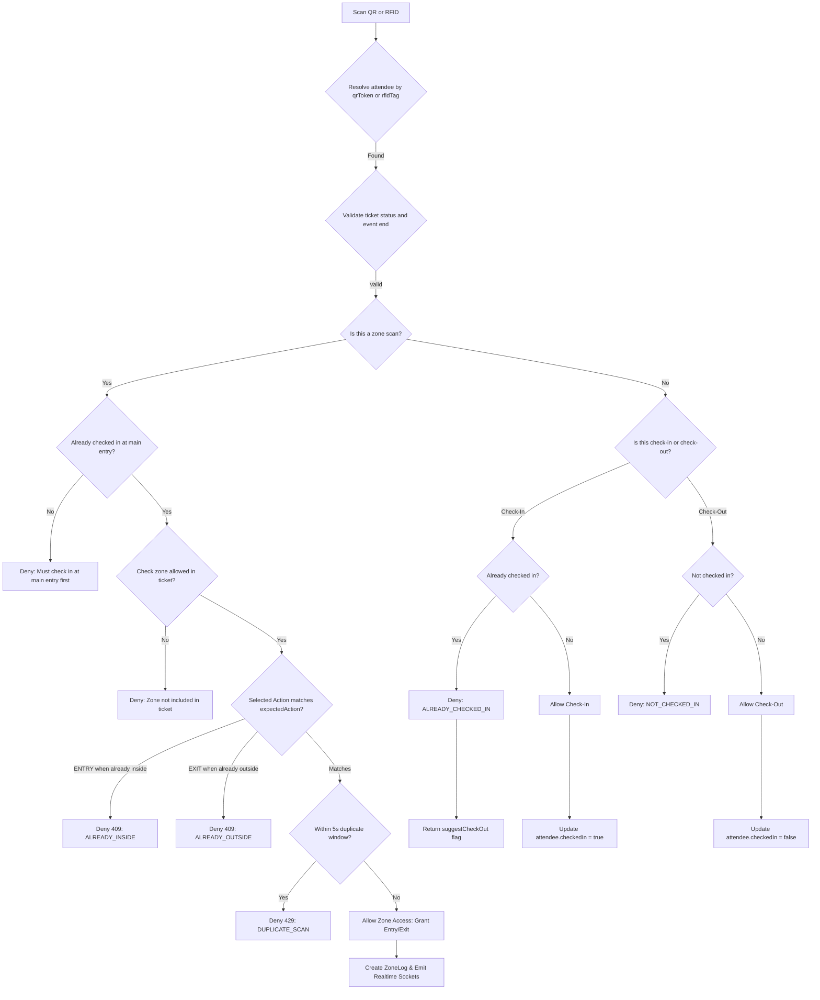

# 11_ZONE_ACCESS_CONTROL

## Overview
Zone access control determines whether an attendee may **enter** or **exit** a physical area (zone) within an event venue. The logic lives primarily in the **backend**:
- `backend/src/models/ZoneLog.js` records each zone scan attempt.
- `backend/src/models/EntryLog.js` records successful entry/exit events at main gates and zone transitions.
- `backend/src/services/notificationService.js` sends real‑time alerts when access is denied.
- Socket.io events (`zone:${zoneId}`, `entry_update`) push live updates to staff dashboards.

## Entry vs Zone Scanning
The system distinguishes between two scanning contexts:

### Entry Scanner (Main Entry/Gates)
- **Purpose**: Check attendees in/out at the main venue entrance
- **Actions**: `check_in` (Entry In), `check_out` (Entry Out)
- **Validations**:
  - Attendee must have valid, confirmed ticket
  - Attendee must not already be checked in (for check-in)
  - Attendee must be checked in (for check-out)
- **Zones**: Uses `gateId`/`gateName` rather than zone IDs
- **RFID Assignment**: After successful check-in, staff can assign RFID to non-RFID attendees

### Zone Scanner (Inner Zones)
- **Purpose**: Track and validate attendee movement into and out of designated venue areas
- **Actions**: `ENTRY` (Zone Entry), `EXIT` (Zone Exit) - explicitly selected by the terminal operator (no automatic inverting)
- **Validations**:
  - Attendee must have checked in at main entry first (`attendee.checkedIn === true`)
  - Attendee's ticket must allow access to the zone (`allowedZones` check)
  - Strict movement state validation (`expectedAction`):
    - If scanning for `ENTRY` and the attendee is already inside the zone, returns `409 ALREADY_INSIDE` ("Attendee is already inside this zone. Please scan for EXIT first.")
    - If scanning for `EXIT` and the attendee is already outside the zone, returns `409 ALREADY_OUTSIDE` ("Attendee is already outside this zone. Please scan for ENTRY first.")
  - 5-second duplicate scan debounce protection (`DUPLICATE_SCAN`)
  - Ticket validity (confirmed/sold/active, not cancelled/expired, event not ended)
- **Tracking**: Uses `ZoneLog` for immutable audit records of every entry and exit attempt
- **Terminals**: Staff (`/staff/zone-access`) and Sub-Organiser (`/suborg/zone-scanner`) operate identical 4-tab terminals (Scanner, Manual, Stats, Logs) with synchronized real-time metrics

## Data Model
| Model | Key Fields | Purpose |
|-------|------------|---------|
| **ZoneLog** | `attendeeId`, `eventId`, `zoneName`, `action` (ENTRY/EXIT), `accessGranted`, `denialReason`, `scanMethod`, `scannedBy`, `attendeeSnapshot`, `timestamp` | Immutable audit of every zone scan attempt. |
| **EntryLog** | `attendeeId`, `eventId`, `zoneId`, `zoneName`, `action` (check_in/check_out/zone_entry/zone_exit), `timestamp` | Stores successful entry/exit events for reporting. |
| **Attendee** | `checkedIn` (boolean), `checkedInAt` (timestamp), `currentZone` (zone ID), `rfidTag` | Tracks current access state of attendee. |
| **Ticket** (referenced) | `allowedZones` (array of zone IDs) | Declares which zones a ticket holder may access. |

## Access Evaluation Flow

```mermaid
flowchart TD
    A[Scan QR or RFID] --> B{Resolve attendee by qrToken or rfidTag}
    B -->|Found| C{Validate ticket status and event end}
    C -->|Valid| D{Is this a zone scan?}
    D -->|Yes| E{Already checked in at main entry?}
    D -->|No| F{Is this check-in or check-out?}
    F -->|Check-In| G{Already checked in?}
    F -->|Check-Out| H{Not checked in?}
    G -->|Yes| I[Deny: ALREADY_CHECKED_IN]
    G -->|No| J[Allow Check-In]
    H -->|Yes| K[Deny: NOT_CHECKED_IN]
    H -->|No| L[Allow Check-Out]
    E -->|No| M[Deny: Must check in at main entry first]
    E -->|Yes| N{Check zone allowed in ticket?}
    N -->|No| O[Deny: Zone not included in ticket]
    N -->|Yes| P{Selected Action matches expectedAction?}
    P -->|ENTRY when already inside| Q[Deny 409: ALREADY_INSIDE]
    P -->|EXIT when already outside| R[Deny 409: ALREADY_OUTSIDE]
    P -->|Matches| S{Within 5s duplicate window?}
    S -->|Yes| T[Deny 429: DUPLICATE_SCAN]
    S -->|No| U[Allow Zone Access: Grant Entry/Exit]
    I --> V[Return suggestCheckOut flag]
    J --> W[Update attendee.checkedIn = true]
    L --> X[Update attendee.checkedIn = false]
    U --> Y[Create ZoneLog & Emit Realtime Sockets]
```

1. **Resolve attendee** – The backend checks `qrToken` first or, if the input is a 10-digit RFID, matches `rfidTag` within the selected event.
2. **Validate ticket** – `Ticket` is fetched and must be in a status that permits entry (`CONFIRMED`, `SOLD`, or equivalent allowed states), and event must not have ended.
3. **Check access based on context**:
   - **Entry scan**: Validate check-in/check-out state
   - **Zone scan**: Validate main entry check-in first, check zone permission, verify `expectedAction`, and enforce 5-second duplicate protection.
4. **Grant/Deny** – Appropriate log entry is created with `accessGranted` flag, `denialReason`, and attendee snapshot.
5. **Notification & Sockets** – Dispatches real-time Socket.IO broadcasts on both `zone_scan` and `zone_update` channels to update all active staff and sub-organiser terminals immediately.

## Terminal Architecture & Layout (Staff & Sub-Organiser)
Both the Staff Zone Access Terminal (`/staff/zone-access`) and the Sub-Organiser Zone Scanner (`/suborg/zone-scanner`) share an identical, synchronized design:

1. **Top Bar**: Exit console navigation and live connectivity indicator (Online/Offline status).
2. **Header & Active Zone Banner**: Shows the currently selected event and zone name.
3. **Last Scan Card**: Live card presenting the most recently scanned attendee, timestamp, ticket type, zone, and operator name.
4. **4-Tab Navigation**:
   - **Scanner Tab**:
     - Mode toggle: `Zone Entry` vs `Zone Exit` (persists operator's selection).
     - Reader toggle: `QR Camera` (using HTML5-QRCode with AbortError guards) vs `RFID Reader` (autofocused input for 10-digit USB wedge scanner).
     - Comprehensive `ResultCard` showing success or denial details.
   - **Manual Tab**: Dedicated search input for manually pasting or typing tokens with immediate validation.
   - **Stats Tab**: Metric cards showing today's `Total Scans`, `Allowed`, and `Denied`, plus Active Zone Setup with Event and Zone dropdown switchers.
   - **Logs Tab**: Paginated activity list of recent zone scans with time and status.

## Offline Mode & Automatic Synchronization
- Scans executed while offline are cached in local browser storage under the key `entrynex:offline-zone-scans`.
- Offline entries are simulated locally with instant audio/haptic feedback to keep entry gates moving.
- When network connectivity is restored (`online` window event), the terminal automatically replays queued scans to `/api/zone/scan`, notifies the operator via toast notifications, and re-synchronizes logs and metrics.

## RFID as a First-Class Access Method
RFID is treated identically to QR for event access:
- **QR flow**: scan generated QR code, resolve attendee via `qrToken`
- **RFID flow**: present card to reader, normalize 10-digit value, resolve attendee via `rfidTag`
- **Credential Deduplication**: QR check-in → RFID check-out is allowed (and vice versa)
- **Auditing**: Every scan records the input method (`method: 'qr' | 'rfid'`).

## RFID Feature Toggle
RFID functionality is controlled by event settings (`event.settings.rfidEnabled`):
- When disabled, RFID reader toggles are hidden and backend returns `403 RFID_DISABLED`.
- When enabled, staff and sub-organisers can use the dedicated RFID wedge reader mode.
- *Note:* Dedicated RFID card pairing is managed via the RFID Assignment pages (`/staff/rfid-assignment`, `/suborg/rfid-assignment`), keeping the zone terminal optimized exclusively for high-throughput scanning.

## API Endpoints
### Entry Scanning
- `POST /api/entry/scan` - Main entry check-in/check-out
- `POST /api/sub/scan-entry` - Sub-organizer entry scanning
- `POST /api/staff/scan-entry` - Staff entry scanning (delegates to entry routes)

### Zone Scanning
- `POST /api/zone/scan` - Unified zone entry/exit validation (supported by both Staff and Sub-Organiser roles)
- `GET /api/zone/logs` - Query recent zone activity logs; returns formatted log list and live `meta` (`totalScanned`, `allowedCount`, `deniedCount`)
- `POST /api/sub/scan-zone` - Sub-organizer zone scan endpoint (validates `action`, `expectedAction`, and emits real-time updates)
- `POST /api/staff/scan-zone` - Staff zone scanning (delegates directly to `/api/zone/scan`)

### RFID Assignment
- `POST /api/entry/rfid-assign` - Assign RFID after QR scan (main entry flow)
- `POST /api/sub/attendees/:id/rfid` - Sub-organizer RFID assignment
- `POST /api/attendees/:id/rfid` - Dedicated attendee RFID pairing

---
*All details derived from `ZoneLog.js`, `EntryLog.js`, `backend/src/routes/zone.js`, `backend/src/routes/sub.js`, `StaffZoneAccessPage.jsx`, and `SubOrgZoneScannerPage.jsx`.*
