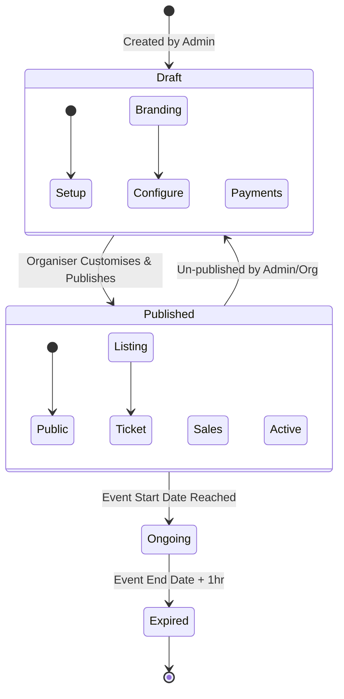
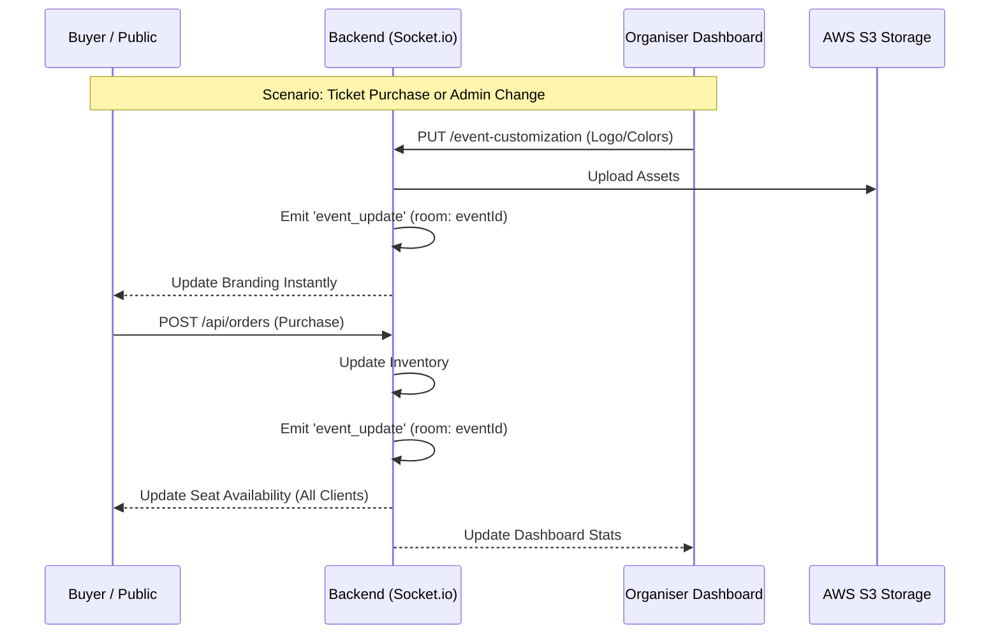

# EAMS Visual Architecture & System Flows

This document provides visual representations of the EAMS system architecture, event lifecycles, and real-time data flows.

## 1. Event Lifecycle & Visibility Flow



### 2. Real-Time Data Synchronization

EAMS uses Socket.io to ensure all users see the latest state of the event instantly.



## 3. High-Level System Architecture

```
┌─────────────────────────────────────────────────────────────────────────┐
│                         ENTRYNEX SYSTEM ECOSYSTEM                         │
├─────────────────────────────────────────────────────────────────────────┤
│                                                                           │
│  FRONTEND (React)                                                        │
│  ┌──────────────────────────────────────────────────────────────────┐   │
│  │  Pages: Home, Checkout, Confirmation, Organiser Dashboard        │   │
│  │  State: Socket.io-client (Real-time listener)                    │   │
│  └──────────────────────────────────────────────────────────────────┘   │
│           │                                                              │
│           ├─→ REST API Requests                                         │
│           └─→ WebSocket Events (Branding, Seats, Check-ins)            │
│                                                                         │
│  BACKEND (Node.js/Express)                                             │
│  ┌──────────────────────────────────────────────────────────────────┐  │
│  │  Services Layer                                                   │  │
│  │  ├─ Notification Engine (Decoupled Email + Twilio SMS)           │  │
│  │  ├─ Storage Service (AWS S3 Integration)                         │  │
│  │  ├─ PDF Generator (Ticket QR Generation)                         │  │
│  │  └─ Socket Manager (Room-based broadcasting)                      │  │
│  └──────────────────────────────────────────────────────────────────┘  │
│           │                    │                    │                    │
│           ↓                    ↓                    ↓                    │
│  ┌──────────────────┐  ┌──────────────────┐  ┌──────────────────┐        │
│  │     MongoDB      │  │      AWS S3      │  │     Twilio       │        │
│  │ (Data Persistence)│  │ (Photos/Assets)  │  │ (SMS Gateway)    │        │
│  └──────────────────┘  └──────────────────┘  └──────────────────┘        │
│                                                                         │
└─────────────────────────────────────────────────────────────────────────┘
```

## 4. Database Collections

```
┌──────────────────────────────────────────────────────────────────┐
│  Collections                                                      │
├──────────────────────────────────────────────────────────────────┤
│  ├─ Orders                                                        │
│  │  ├─ _id                                                       │
│  │  ├─ orderNumber                                               │
│  │  │  ├─ confirmationToken (UUID)                                 │  │
│  │  │  ├─ allAssigned: Boolean ← NEW                               │  │
│  │  │  └─ status                                                    │  │
│  │  │                                                               │  │
│  │  ├─ Tickets                                                      │  │
│  │  │  ├─ _id                                                       │  │
│  │  │  ├─ order → Order._id                                        │  │
│  │  │  ├─ attendee → Attendee._id (nullable)                      │  │
│  │  │  ├─ status: [PENDING|ASSIGNED|INVITED|CONFIRMED]            │  │
│  │  │  ├─ categoryName, slotIndex                                  │  │
│  │  │  ├─ inviteEmail, inviteToken                                 │  │
│  │  │  └─ inviteSentAt                                             │  │
│  │  │                                                               │  │
│  │  └─ Attendees                                                    │  │
│  │     ├─ _id                                                       │  │
│  │     ├─ fullName, email                                          │  │
│  │     ├─ dateOfBirth, nationalId, passportNumber                 │  │
│  │     ├─ order, ticket                                            │  │
│  │     ├─ confirmationToken, qrToken                               │  │
│  │     ├─ qrCode (base64)                                          │  │
│  │     ├─ confirmationStatus                                       │  │
│  │     └─ confirmedAt                                              │  │
│  └──────────────────────────────────────────────────────────────────┘  │
│                                                                         │
└─────────────────────────────────────────────────────────────────────────┘
```

---

## Request/Response Flow Diagram

### Flow 1: Self-Assignment

```
┌─────────────┐
│   Browser   │
└──────┬──────┘
       │
       │ 1. User clicks "Assign Myself"
       │
       ├─→ ┌──────────────────────┐
       │   │ AssignModal Opens     │
       │   │ (Form displays)       │
       │   └──────────────────────┘
       │
       │ 2. User fills form & clicks "Assign Ticket"
       │
       ├─→ ┌────────────────────────────────────────────┐
       │   │ POST /api/tickets/assign                   │
       │   │ {                                           │
       │   │   ticketId: "...",                         │
       │   │   fullName: "Jane Smith",                  │
       │   │   email: "jane@example.com",               │
       │   │   dateOfBirth: "1990-05-15",              │
       │   │   nationalId: "123456789V"                │
       │   │ }                                           │
       │   └─────────────┬──────────────────────────────┘
       │                 │
       │                 ↓
       │   ┌──────────────────────────────────┐
       │   │ Backend Processing                │
       │   ├──────────────────────────────────┤
       │   │ 1. Validate input                 │
       │   │ 2. Check ticket.status='PENDING'  │
       │   │ 3. Create Attendee                │
       │   │    - Generate qrToken, QR code   │
       │   │    - Set confirmationStatus      │
       │   │ 4. Update Ticket                  │
       │   │    - attendee = newAttendee      │
       │   │    - status = 'ASSIGNED'         │
       │   │ 5. Check all tickets assigned    │
       │   │    - Calculate proportion        │
       │   │    - Update Order.allAssigned    │
       │   └─────────────┬────────────────────┘
       │                 │
       │                 ↓
       │   ┌──────────────────────────────┐
       │   │ Response (200 OK)             │
       │   │ {                             │
       │   │   attendee: {...},            │
       │   │   ticket: { status: 'ASSIGNED' }
       │   │ }                             │
       │   └─────────────┬─────────────────┘
       │                 │
       ├←─────────────────┘
       │
       │ 3. Frontend processes response
       │
       ├─→ ┌────────────────────────────────┐
       │   │ Close Modal                     │
       │   │ Show Toast: "Assigned!"         │
       │   │ Call load()                     │
       │   └─────────────┬────────────────────┘
       │                 │
       │                 ↓
       │   ┌────────────────────────────────┐
       │   │ GET /api/orders/confirm/:token │
       │   └─────────────┬────────────────────┘
       │                 │
       │                 ↓
       │   ┌────────────────────────────────┐
       │   │ Update State                    │
       │   │ - Refresh ticket data          │
       │   │ - Recalculate progress         │
       │   │ - Update badges               │
       │   └─────────────┬────────────────────┘
       │                 │
       │                 ↓
       │   ┌────────────────────────────────┐
       │   │ UI Updates                      │
       │   │ - Progress bar: 33%             │
       │   │ - Ticket status: "Assigned"    │
       │   │ - Show attendee name            │
       │   │ - Hide action buttons           │
       │   │ - Show checkmark                │
       │   └────────────────────────────────┘
       │
       └─→ [Icon: Success] Assignment Complete
```

---

### Flow 2: Invite Workflow

```
┌──────────────┐
│   Browser    │  Buyer
└──────┬───────┘
       │
       │ 1. User clicks "Send Invite"
       │
       ├─→ ┌────────────────────────────────────┐
           │ Prompt: Enter email to invite      │
           │ User enters: "guest@example.com"   │
           └─────────────┬──────────────────────┘
                         │
       ├─→ ┌────────────────────────────────────┐
       │   │ POST /api/tickets/invite           │
       │   │ {                                   │
       │   │   ticketId: "...",                 │
       │   │   email: "guest@example.com"      │
       │   │ }                                   │
       │   └─────────────┬──────────────────────┘
       │                 │
       │                 ↓
       │   ┌──────────────────────────────┐
       │   │ Backend Processing            │
       │   ├──────────────────────────────┤
       │   │ 1. Validate email             │
       │   │ 2. Check ticket.status       │
       │   │ 3. Create Attendee            │
       │   │    - email only               │
       │   │    - confirmationToken        │
       │   │    - status: 'invited'        │
       │   │ 4. Update Ticket              │
       │   │    - status = 'INVITED'       │
       │   │    - inviteEmail              │
       │   │    - inviteToken              │
       │   │ 5. Send invite email          │
       │   │    - Link: /attendee/confirm  │
       │   │    - Token in URL             │
       │   └─────────────┬────────────────┘
       │                 │
       │                 ↓
       │   ┌──────────────────────────────┐
       │   │ Response (200 OK)              │
       │   │ {                              │
       │   │   ticket: {                   │
       │   │     status: 'INVITED'         │
       │   │     inviteEmail: "..."        │
       │   │   }                            │
       │   │ }                              │
       │   └─────────────┬────────────────┘
       │                 │
       ├←─────────────────┘
       │
       │ 2. Frontend updates UI
       │
       ├─→ ┌──────────────────────────────┐
       │   │ Toast: "Invite sent!"         │
       │   │ Update ticket card            │
       │   │ - Status: "INVITED"           │
       │   │ - Show email icon             │
       │   │ - Show email address          │
       │   └──────────────────────────────┘
       │
       └─→ [Icon: Success] Invite Sent
          
       ┌───────────────────────────────────────────────┐
       │ Meanwhile: Guest receives email...            │
       ├───────────────────────────────────────────────┤
       │                                               │
       │ Email Subject: "You're invited to [Event]"   │
       │ Email Body:                                  │
       │   "Confirm your attendance..."               │
       │   [Confirm Button]                           │
       │   Opens: /attendee/confirm/{confirmToken}    │
       └───────────────────────────────────────────────┘
          
       ┌──────────────┐
       │   Browser    │  Guest
       └──────┬───────┘
              │
              │ 3. Guest clicks email link
              │
              ├─→ ┌─────────────────────────────────┐
                  │ /attendee/confirm/:token page    │
                  │ Shows confirmation form          │
                  │ ├─ Full Name                    │
                  │ ├─ Email                        │
                  │ ├─ Date of Birth                │
                  │ ├─ ID                           │
                  │ └─ Confirm Button               │
                  └────────────┬────────────────────┘
                               │
              ├─→ ┌─────────────────────────────────┐
              │   │ Guest fills form                │
              │   │ Clicks "Confirm"               │
              │   └────────────┬────────────────────┘
              │                │
              │                ↓
              │   ┌──────────────────────────────────┐
              │   │ POST /api/attendees/confirm/:t   │
              │   │ {                                │
              │   │   fullName: "Guest Name",        │
              │   │   email: "guest@example.com",   │
              │   │   dateOfBirth: "1995-03-20",   │
              │   │   nationalId: "..."             │
              │   │ }                                │
              │   └────────────┬─────────────────────┘
              │                │
              │                ↓
              │   ┌───────────────────────────────────┐
              │   │ Backend Processing                │
              │   ├───────────────────────────────────┤
              │   │ 1. Find Attendee by token        │
              │   │ 2. Update with details           │
              │   │ 3. Generate QR code              │
              │   │ 4. Update Attendee status        │
              │   │    - confirmationStatus='conf'   │
              │   │ 5. Update Ticket                 │
              │   │    - status = 'CONFIRMED'       │
              │   │ 6. Check if Order complete       │
              │   │ 7. Send confirmation email       │
              │   └────────────┬──────────────────────┘
              │                │
              │                ↓
              │   ┌───────────────────────────────────┐
              │   │ Response (200 OK)                 │
              │   │ {                                │
              │   │   attendee: {...},              │
              │   │   message: "Confirmed!"         │
              │   │ }                                │
              │   └────────────┬──────────────────────┘
              │                │
              ├←───────────────┘
              │
              └─→ [Icon: Success] Guest Identity Confirmed
                  
       Meanwhile on Buyer's Portal:
       
       ┌──────────────┐
       │ Buyer at DB  │  After Guest Confirms
       └──────┬───────┘
              │
              │ Portal refreshes (auto-refresh or manual)
              │
              ├─→ ┌────────────────────────────────────┐
              │   │ GET /api/orders/confirm/:token     │
              │   │ (ticket status now: CONFIRMED)     │
              │   └────────────┬─────────────────────────┘
              │                │
              │                ↓
              │   ┌────────────────────────────────────┐
              │   │ UI Updates                         │
              │   │ - Ticket shows: "Confirmed"       │
              │   │ - Guest name displays              │
              │   │ - Progress: "2 of 3 confirmed"    │
              │   └────────────────────────────────────┘
              │
              └─→ [Icon: Success] Workflow Complete
```

---

## Database Relationships Diagram

```
┌─────────────────────────────────────────────────────────────────────┐
│                    DATABASE RELATIONSHIPS                           │
└─────────────────────────────────────────────────────────────────────┘

┌──────────────────────┐
│      ORDER           │
├──────────────────────┤
│ _id                  │
│ orderNumber          │
│ confirmationToken    │
│ buyerName            │
│ buyerEmail           │
│ totalAmount          │
│ allAssigned ◄────┐   │
│ timestamps       │   │
└──────────────────┘   │
        │              │
        │ 1:N          │
        │              │
        ↓              │
┌──────────────────────┐
│      TICKET          │
├──────────────────────┤
│ _id                  │
│ order ──────────────→║ (ref: Order)
│ event ──────────────→ (ref: Event)
│ attendee ───────────→ (ref: Attendee)
│ categoryName         │
│ slotIndex            │
│ status               │ ◄─── PENDING
│ price                │      ASSIGNED
│ inviteEmail          │      INVITED
│ inviteToken          │      CONFIRMED
│ ticketNumber         │
└──────────────────────┘
        │
        │ 1:1
        │
        ↓
┌──────────────────────┐
│    ATTENDEE          │
├──────────────────────┤
│ _id                  │
│ fullName             │
│ email                │
│ dateOfBirth          │
│ nationalId           │
│ passportNumber       │
│ order  (ref: Order)  │
│ ticket (ref: Ticket) │
│ event  (ref: Event)  │
│ confirmationToken    │
│ qrToken              │
│ qrCode               │
│ confirmationStatus   │
│ confirmedAt          │
└──────────────────────┘

Status Transitions:
─────────────────────

Order.allAssigned: false ──→ true
                   (when all tickets assigned/confirmed)

Ticket Status Flow:
┌─────────┐
│ PENDING │
└────┬────┘
     │
     ├─→ "Assign Myself"
     │   └─→ ┌─────────┐
     │       │ ASSIGNED│ (immediate)
     │       └─────────┘
     │
     └─→ "Send Invite"
         └─→ ┌────────┐      ┌───────────┐
             │ INVITED│ ────→│ ASSIGNED  │
             └────────┘      │ (when     │
                             │ confirmed)│
                             └───────────┘

All paths → CONFIRMED
           (final state)
```

---

## Component State Flow

```
ConfirmOrderPage Component Lifecycle
───────────────────────────────────────

MOUNT
  ├─ useEffect([token])
  │  └─ Call load()
  │     └─ GET /orders/confirm/:token
  │        └─ setData(response)
  │           └─ setLoading(false)
  │
  └─→ Initial Render
     ├─ data = null, loading = true
     └─ Shows spinner

LOADED
  ├─ data populated
  ├─ tickets array filled
  ├─ Progress calculated
  │  └─ (assignedCount / totalCount) * 100
  │
  └─→ Render
     ├─ Order summary visible
     ├─ Ticket cards displayed
     ├─ Progress bar shows percentage
     └─ Action buttons enabled

USER CLICKS "ASSIGN MYSELF"
  ├─ handleAssignMyself(ticketId)
  │  ├─ setAssignModal({ open: true, ticketId })
  │  ├─ setAssignForm(resetForm)
  │  └─ setAssignErrors({})
  │
  └─→ Modal opens
     ├─ Form fields cleared
     ├─ Focus on first input
     └─ Overlay shown

USER FILLS FORM & SUBMITS
  ├─ handleAssignSubmit(e)
  │  ├─ setAssigning({ [ticketId]: true }) ◄─ Show loading
  │  ├─ Call assignTicket(formData)
  │  │  └─ POST /tickets/assign
  │  │
  │  ├─ On Success
  │  │  ├─ toast.success("Assigned!")
  │  │  ├─ setAssignModal({ open: false })
  │  │  ├─ Call load() ◄─ Refresh data
  │  │  │  └─ State update triggers re-render
  │  │  └─ Modal closes
  │  │
  │  └─ On Error
  │     ├─ Parse error.response.data.errors
  │     ├─ setAssignErrors(errorMap)
  │     ├─ Display inline error messages
  │     └─ Modal stays open
  │
  └─→ Re-render shows updated data
     ├─ Progress: +1 assigned
     ├─ Ticket status: "Assigned"
     ├─ Attendee name visible
     ├─ Action buttons hidden
     └─ Checkmark shown

ALL TICKETS ASSIGNED
  ├─ assigned = tickets.length
  ├─ progressPercentage = 100
  │
  └─→ Render
     ├─ Progress bar full (green)
     ├─ "All tickets confirmed!" message
     ├─ "Complete Confirmation" button appears
     └─ Final email sent to buyer
```

---

## Status Badge Logic

```
Ticket Status → Badge Display
──────────────────────────────

PENDING
  ├─ Color: Yellow
  ├─ Text: "Needs Assignment"
  ├─ Buttons: ["Assign Myself", "Send Invite"]
  └─ Attendee: Hidden

ASSIGNED
  ├─ Color: Green
  ├─ Text: "Assigned"
  ├─ Buttons: Hidden
  ├─ Attendee: Name + Email shown
  └─ Icon: ✓ Checkmark

INVITED
  ├─ Color: Blue
  ├─ Text: "Invited"
  ├─ Buttons: Hidden
  ├─ Attendee: Email shown with [Icon: Email] icon
  └─ Note: "Waiting for confirmation"

CONFIRMED
  ├─ Color: Green
  ├─ Text: "Confirmed"
  ├─ Buttons: Hidden
  ├─ Attendee: Full details shown
  └─ Icon: ✓ Checkmark

CANCELLED
  ├─ Color: Gray
  ├─ Text: "Cancelled"
  ├─ Buttons: Hidden
  └─ Attendee: Hidden
```

---

## Error Handling Flow

```
Error Handling Strategy
──────────────────────────

API Call
  │
  ├─ Success (2xx)
  │  └─ Process response
  │     ├─ Update state
  │     ├─ Show success toast
  │     └─ Refresh data
  │
  └─ Error (4xx, 5xx)
     │
     ├─ Validation Error (400)
     │  ├─ Parse error.response.data.errors
     │  ├─ Build errorMap: { [field]: message }
     │  ├─ setAssignErrors(errorMap)
     │  └─ Display field errors under inputs
     │
     ├─ Not Found (404)
     │  ├─ toast.error("Ticket not found")
     │  └─ Keep modal open
     │
     ├─ Conflict (400 - already assigned)
     │  ├─ toast.error("Ticket already assigned")
     │  ├─ Reload order data
     │  └─ Modal closes
     │
     ├─ Server Error (5xx)
     │  ├─ toast.error("Failed to assign ticket")
     │  └─ Keep modal open (retry)
     │
     └─ Network Error
        ├─ toast.error("Network error")
        └─ Retry option available

Form Validation
  │
  ├─ Client-side (immediate)
  │  ├─ fullName: required, non-empty
  │  ├─ email: required, valid format
  │  └─ Display error under field
  │
  └─ Server-side (on submit)
     ├─ Express-validator rules
     ├─ Detailed error messages
     └─ Return to client for display
```

---

## Progress Calculation

```
Progress Bar Logic
───────────────────

Data: tickets array with status field

Calculation:
  assignedCount = tickets.filter(t => 
    t.status === 'ASSIGNED' || 
    t.status === 'CONFIRMED'
  ).length

  totalCount = tickets.length

  progressPercentage = (assignedCount / totalCount) * 100

Display:
  <div style={{ width: `${progressPercentage}%` }}
       className="bg-gradient-to-r from-blue-500 to-green-500">
  
Updates:
  After each action
  ├─ load() → fetch fresh data
  ├─ setData() → state update
  ├─ Re-calculate progressPercentage
  ├─ Progress bar animates (transition-all duration-500)
  └─ Text updates: "X of Y assigned"

Edge Cases:
  0 tickets → Hide progress bar
  All pending → 0%
  All confirmed → 100%
  Mix → Proportional percentage
```

---

**End of Visual Documentation**
